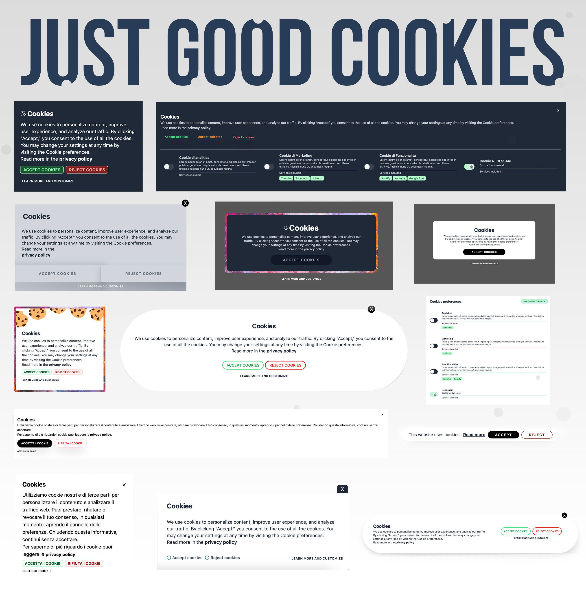
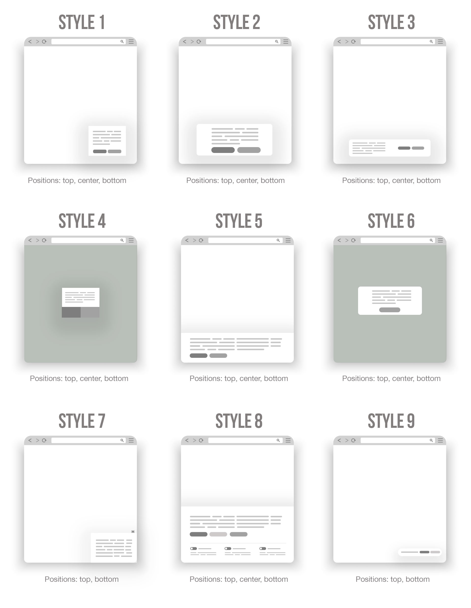

# Just Good Cookies (JGC)



> **Please note**: JGC is in its **pre-release stage** It may be buggy and may not work as expected. Some features may be added, **others may be completely removed or delayed**.
> 🚧 It is currently being actively tested. Use at your own risk! 🚧

Just Good Cookies (JGC) is a simple (but delicious) cookie consent solution made in vanilla JavaScript.
It is designed to be fast, painless and easy to use.
JGC supports both automatic and manual cookie blocking modes, and also generates a fully automatic settings panel.

This library provides 9 different banner styles that **ONLY** work in conjunction with TailwindCSS ❤️ (which is not included in the package, so you can decide for yourself how to integrate it, see [below](#tailwind)).

## Key features

- 🍾 **Free and Open Source**: No pro plans, no subscriptions, no limits, no hidden fees, no surprises. I made it for myself, but I am happy to share it with everyone.
- 👌 **Standalone**: No external dependencies, just pure JS.
- 💅 **9 prebuilt styles ready to work with TailwindCSS**: You need to install Tailwind in order to use JGC.
  And it works with custom prefixes too, so if you prefer to use your own css (or another framework 😢) you can do that (and leave Tailwind only for the banner).
- ✏️ **Customization**: Change colors, positions, texts, styles, languages, buttons, behaviours, icons and much more!
- 🤙🏻 **Manual block**: JGC allows you to block cookies manually by defining data attributes.
- 🤖 **Auto mode**: This is a beta feature that allows you to block scripts and iFrames without having to mark them first. It definitely needs improvement, but it works great!
- 🎛 **Preference panel**: JGC generates a preference panel without you having to write a single line of code. You can even customize the [header and footer with plain html](<(#customizepanel)>). Give users the ability to revoke their consent!
- 🍪 **Cookie categories**: Defines different cookie categories with opt-in/out toggle (JGC will group them automatically in the preferences panel). You can also define some "necessary" cookies that users cannot turn off. Get granular cookie consent for categories!
- 🇪🇺 **GDPR compliant**: It's really easy to be compliant using JGC (it's up to you to comply with your state's regulations).
- 🇮🇹 **Multilingual**: Contributions welcome! Please, per favore, bitte, por favor, s'il vous plaît. I need your help 🙏
- 👨‍💻 **Developer friendly**: You can run the callbacks "onAccept" and "onReject" to store the proof of the consent (the backend is up to you, but it's pretty easy...maybe I can post an example in another repo if you want)
- 🌙 **Dark mode**: Supports dark mode according to Tailwind rules
- 🖼 **Someone said "placeholder"?**: This is something cool. You can define placeholders to hide the scripts until the user accepts the cookies. You can set a generic text, a default image or a custom one for each iFrame you block.

## Donations

JFC is a free open-source project that I work on in my spare time (but hey, I put a lot of work into it). <br/>
If you want to support the project, you can buy me a coffee or a beer (or two 🍻, I love beer) ❤️!
Thank you!

<a href="https://www.buymeacoffee.com/mugnai" target="_blank"></a>

<hr/>

# Table of Contents

### Intro and examples

1. [Installation](#installation)
2. [How it works](#how)
3. [How to embed TailwindCSS](#tailwind)
4. [Full example](#full)
5. [Main Configuration](#main)
6. [Styles](#styles)

### Customization

7.  [Text](#customtext)
8.  [Banner](#banner)
9.  [Placeholder](#placeholder)
10. [Cookies](#cookies)
11. [Activate](#activate)
12. [Panel](#panel)

### HOWTOs

13. [How to customize the panel header and footer using custom divs](#customizepanel)
14. [How to fire the preference panel from a button](#firepreferences)
15. [How to replace the banner description with a custom div](#replacedescription)
16. [How to mix and merge the automatic mode and the manual one](#mix)
17. [How to use custom fonts](#fonts)
18. [How to submit a new translation](#translation)
19. [How to avoid flickering](#flickering)
20. [How to install it on a website (eg. WordPress) that uses a different CSS framework](#otherFramwork)
21. [Browser support and how to deal with out-of-date browsers](#browsers)

### Disclaimer

22. [Disclaimer](#disclaimerArea)
23. [ToDo](#toDo)

<hr>

<span name="installation"></span>

## Installation

There are 2 ways to use JGC in your projects:

- with the CDN
- as module

#### Using the CDN:

1. Copy this script and paste it on your site (ideally into the head tag)

```js
<script src="https://cdn.jsdelivr.net/gh/francescomugnai/just-good-cookies@0.8.1/dist/justgoodcookies.min.js"></script>
```

2. Install Tailwind (if you haven't already, see [below](#tailwind))

3. Initialize JGC

```js
<script>
justgoodcookies.init({
  locale: "it", // ISO 639-1 language code
  layout: "style1",
  privacyLink: "https://www.mysite.com/privacy-policy/",
  cookies: {
    necessary: { // this is mandatory
        title: "Necessary cookies",
        description: "Some text to describe them",
    },
  },
});
</script>
```

4. Tag the cookies you want to block (see ["How it works"](#how))

And...you are done 🚀

#### COMING SOON: Using NPM

<!-- 1. Install the package

```bash
npm install just-good-cookies
```

2. Import it into your bundle

```bash
import justgoodcookies from "just-good-cookies";
```

3. Install Tailwind (if you haven't already, see [below](#tailwind))

4. Initialize JGC (see the previous example) 🚀 -->

<hr>

<span name="tailwind"></span>

## How to embed TailwindCSS

The easiest way to get started with JGC is to use Tailwind's default configuration (their documentation is amazing). You do not need to change anything.

However, if you want to use Tailwind with a custom prefix, you must embed the new CDN: `<script src="https://cdn.tailwindcss.com"></script>`. <br/>
Then remember to add the [`tailwindPrefix`](#tailwindPrefix) parameter in JGC.

Here's a basic example. <br/>

**Tailwind Config**:

```js
tailwind.config = {
  prefix: "jgc-",
};
```

**JGC**:

```js
justgoodcookies.init({
  tailwindPrefix: "jgc-",
  locale: "it", // ISO 639-1 language code
  layout: "style1",
  privacyLink: "https://www.mysite.com/privacy-policy/",
  cookies: {
    necessary: {
      title: "Necessary cookies",
      description: "Some text to describe them",
    },
  },
});
```

> You must use the new CDN because JGC does not work with custom prefixes generated by JIT via webpack, Rollup, Screw, and Parcel. For [this](https://tailwindcss.com/docs/content-configuration#dynamic-class-names) reason.

<span name="how"></span>

## How it works

Two modes:

1. You can manually _tag_ the cookies you want to block.
2. You can use a semi-automatic function to identify and stop them.

#### Manual mode 🤙🏻

Let's see how to block a script or an iframe. It's pretty simple. <br/>
Get one, for example the Spotify widget:

```html
<iframe
  src="https://open.spotify.com/embed/album/1234567890"
  width="300"
  height="380"
  frameborder="0"
  allowtransparency="true"
  allow="encrypted-media"
></iframe>
```

Change it to:

```html
<iframe
  data-jgc-tag="thirdparties"
  data-jgc-src="https://open.spotify.com/embed/album/1234567890"
  data-jgc-service="Spotify widget"
  width="300"
  height="380"
  frameborder="0"
  allowtransparency="true"
  allow="encrypted-media"
></iframe>
```

And you're done. 🎉<br/>

As you can see, I simply replaced `src` with `data-jgc-src` and added `data-jgc-tag` to describe the type of cookie. <br/>
Use the attribute (`data-jgc-service`) to give the cookie a "name" (this value is returned in the settings panel).

#### Auto Mode 🤖

1. Initialize JGC and add two new properties: `autoMode` (boolean) and `autoCategories` (object)

```js
justgoodcookies.init({
  autoMode: true,
  autoCategories: {
    youtube: ['Youtube', 'functionalities'], // example
    spotify: ['Spotify', 'functionalities'], // example
    google: ['Google', 'analytics'], // example
    facebook: ['Facebook', 'marketing'], // example
  },
  locale: "en",
  layout: "style1",
  privacyLink: "https://www.mysite.com/privacy-policy/",
  cookies: {
    analytics: {
        title: "Analtycs or another title",
        description:
            "Lorem ipsum dolor sit amet, consectetur adipiscing elit. Integer pulvinar gravida urna quis vehicula. Vestibulum sed libero ultricies, facilisis nunc ut, accumsan magna.",
    },
    functionalities: {
        title: "Functionalities or another title",
        description:
            "Lorem ipsum dolor sit amet, consectetur adipiscing elit. Integer pulvinar gravida urna quis vehicula. Vestibulum sed libero ultricies, facilisis nunc ut, accumsan magna.",
    },
    necessary: {
        title: "Necessary cookies",
        description: "Lorem ipsum dolor sit amet, consectet",
    },
  },
)}
```

`autoMode` is self-explanatory. <br/>
`autoCategories` describes the scripts you want to block.

- The key is the **domain name of the script** (including the subdomain, if any)
- The array, instead, consists of two parts: **the name of the service** (which can be any string) and the **cookie type** (which must match the key specified in the `cookies` object).

Okay, enough talking — let's see a few examples.
Suppose you have a script like the following:

```html
<iframe
  src="https://www.youtube.com/embed/1234567890"
  width="560"
  height="315"
  title="YouTube video player"
  frameborder="0"
  allow="accelerometer; autoplay; clipboard-write;"
  allowfullscreen
>
</iframe>
```

To block it, you need to set `autoMode` to **true** and populate `autoCategories` in this way:

```js
autoMode: true,
autoCategories: {
    "www.youtube.com": ['Youtube Videos', 'functionalities'],
},
cookies: {
  functionalities: {
      title: "Functionalities or another title",
      description:
          "Lorem ipsum dolor sit amet, consectetur adipiscing elit etc...",
  },
  //...and so on
},
```

The key (_"www.youtube.com"_) is the domain name of the URL you are blocking.<br/>
In the array you have the _name_ of the service (_the name is up to you_) and the _type_ (_functionalities_).
This type must be exactly the same key as that of the `cookie` object. <br/>
See how it works?

Ok, another example: a FB widget.

```html
<iframe
  src="https://www.facebook.com/plugins/...."
  scrolling="yes"
  style="border:none; overflow:hidden; width:300px; height:500px; background: white;  "
  allowtransparency="true"
  frameborder="0"
  data-src="https://www.facebook.com/plugins/..."
></iframe>
```

This is what you have to do:

```js
  autoCategories: {
      "www.facebook.com": ['Facebook Widget', 'marketing'],
  },
  cookies: {
    marketing: {
        title: "Marketing cookies",
        description:
            "Lorem ipsum dolor sit amet, consectetur adipiscing elit. Integer pulvinar gravida urna quis vehicula. Vestibulum sed libero ultricies, facilisis nunc ut, accumsan magna.",
    },
    //...and so on
  },
```

I hope that makes sense. I'll post more examples soon.

#### Limitations of the automatic mode

- It is possible that a script drops a cookie after a few milliseconds (which then disappears when JGC removes the iFrame). I still need to verify this point. Most of the scripts I have tested are blocked without problems.
- The placeholders only work with iFrames (because they have a specific width and height). Of course not with scripts.
- An automatic refresh is required to activate those scripts.

#### Placeholders

JGC allows you to define a placeholder (text or img) to overlay the blocked iFrames.<br/>
If you want to use a text placeholder add the attribute `data-jgc-placeholder-text`.

```html
<iframe
  data-jgc-placeholder-text="This is a placeholder"
  data-jgc-service="Spotify widget"
  data-jgc-tag="thirdparties"
  data-jgc-src="https://open.spotify.com/embed/album/1234567890"
  width="300"
  height="380"
  frameborder="0"
  allowtransparency="true"
  allow="encrypted-media"
></iframe>
```

Sometimes you may want to use an image as a placeholder.
In that case use the `data-jgc-placeholder-img` attribute.

```html
<iframe
  data-jgc-placeholder-img="https://images.unsplash.com/photo-1567095761054-7a02e69e5c43?ixlib=rb-1.2.1&ixid=MnwxMjA3fDB8MHxwaG90by1wYWdlfHx8fGVufDB8fHx8&auto=format&fit=crop&w=987&q=80"
  data-jgc-service="Spotify widget"
  data-jgc-tag="thirdparties"
  data-jgc-src="https://open.spotify.com/embed/album/1234567890"
  width="300"
  height="380"
  frameborder="0"
  allowtransparency="true"
  allow="encrypted-media"
></iframe>
```

Now, suppose you are using autoMode (or manual mode) and want to load a generic placeholder over all blocked iFrames.
It's simple, add this object to your script:

```js
placeholder: {
  text: "This is a placeholder <br/> Click here to change preferences.",
  classes: 'bg-green-200 text-white bg-cover text-center', // use some classes to center or stylize the placeholder
}
```

or this one:

```js
placeholder: {
    classes: 'bg-cover',
    image: 'https://images.unsplash.com/photo-1607827448387-a67db1383b59?ixlib=rb-1.2.1&ixid=MnwxMjA3fDB8MHxwaG90by1wYWdlfHx8fGVufDB8fHx8&auto=format&fit=crop&w=2670&q=80'
}
```

How cool is that, huh?

<hr/>

#### BETA: The special attribute `data-jgc-remove`

In other situations, you will have to deal with scripts that are **very difficult** to block (they release cookies even if you change the "src" attribute). <br/>
In these special cases, you can either use autoMode (hiding the scripts [with the css](#flickering)) or manual mode adding the `data-jgc-remove` attribute on the parent div.

A few notes about the `data-jgc-remove` implementation:

- The page will be refreshed once the user has accepted the cookies (because we remove the scripts from DOM and you can not reactivate them without refreshing).
- You can not use placeholders for these elements
- The two data attributes `data-jgc-service` and `data-jgc-tag` must be placed on the parent div (keeping the original script with the default attributes)
- I'm improving autoMode to make this parameter obsolete so....don't rely that much on it

Example:

```html
<div
  data-jgc-remove
  data-jgc-service="Not so impossible to block after all"
  data-jgc-tag="marketing"
>
  <script
    type="text/javascript"
    src="https://impossiblesitetoblock.com/jsform/1234"
  ></script>
</div>
```

It's pretty simple 🥳

<span name="full"></span>

## Full example

Here is an example of **all** properties that can be set during initialization:

```js
<script>
  justgoodcookies.init({
    locale: "it",
    layout: "style1",
    privacyLink: "https://www.mysite.com/privacy-policy/",
    cookieDuration: 182, // in days, default cookie duration 360 days
    tailwindPrefix: "jgc-",
    dark: true,
    banner: {
      animation: true,
      backgroundColor:'bg-color',
      backgroundDark: true,
      backgroundImage: '/path/to/image.jpg',
      closeButton: false,
      closeButtonAccept: true,
      disableReject: false,
      icon: "/assets/cookies_icon.svg",
      iconDark: "/assets/cookies_icon_dark.svg",
      innerBackgroundImage: '/assets/cookies-style6.svg',
      logo: "/assets/logo.svg",
      logoClasses: 'w-2/4',
      maxWidth: 'xl',
      onAccept(){},
      onReject(){},
      position: "bottom",
      shortText: false,
      title: "Custom title",
    },
    cookies: {
      necessary: { // MANDATORY
        title: "Necessary cookies",
        description: "Lorem ipsum dolor sit amet,consectet",
      },
      // analytcs here is an example, just "necessary" is mandatory
      analytics: {
        title: "Analtycs or another title",
        description:
          "Lorem ipsum dolor sit amet, consectetur adipiscing elit. Integer pulvinar gravida urna quis vehicula. Vestibulum sed libero ultricies, facilisis nunc ut, accumsan magna.",
      },
    },
    placeholder: {
      text: "This is a placeholder <br/> Click here to change preferences.",
      classes: 'bg-green-200 text-white bg-cover text-center',
      image: 'https://images.unsplash.com/photo-1638913976954-8f7b612867c2?ixlib=rb-1.2.1&ixid=MnwxMjA3fDF8MHxwaG90by1wYWdlfHx8fGVufDB8fHx8&auto=format&fit=crop&w=2670&q=80'
    },
    text: {
      acceptSelectedText: 'custom text',
      acceptText: 'custom text',
      bannerLinkLabel: 'custom text',
      descriptionText: 'custom text',
      panelTitle: 'custom text',
      preferencesText: 'custom text',
      rejectText: 'custom text',
      saveButton: 'custom text',
      saveAllButton: 'custom text',
      servicesTag: 'custom text'
    },
    style: {
      accept: 'mt-2 text-green-600',
      bannerText: 'text-green-800',
      bannerTitle: '"text-white',
      closeButton: 'text-sky-100 bg-black',
      lockIcon: "text-red-500",
      panelHeader: 'md:flex justify-between px-4 py-4',
      panelText: 'text-red-300',
      panelTitle: 'text-white',
      preferencesText: 'text-black mt-4 border-0',
      privacyLink: 'text-black font-bold text-sm',
      reject: 'text-red-800 font-semibold text-xs px-2 py-0.5 mt-2',
      saveButton: 'text-md font-bold bg-white text-red-800 hover:bg-red-900',
      saveAllButton: 'text-md font-bold bg-white text-red-800 hover:bg-red-900',
      servicesTag: 'text-white',
      servicesText: 'text-yellow-400',
      stripes:'odd:bg-green-100 even:bg-green-800',
      toggles: 'bg-red-800',
    },
    activate: {
      GoogleTagManager: {
        container_id: 'GTM-EXAMPLE',
        dataJgcTag:"necessary", // The JGC tag of this script
        dataJgcService:"GoogleTagManager", // Custom name
        event_name: 'jgc-cookies-accepted', // example
        variables: [
            ['author', 'test'], // example
            ['price', 'test'] // example
        ]
      },
      GoogleAnalytics: {
          id: 'G-EXAMPLE', // example
          anonymized: true,
          dataJgcTag:"necessary", // cookie tag
          dataJgcService:"Google Analytics", // custom name
          ad_storage: false,
          analytics_storage: false
      },
      FacebookPixel: {
          init: 'EXAMPLE', // example
          dataJgcTag: 'functionalities', // cookie tag
          dataJgcService:"Facebook Pixel", // custom name
      },
    },
    panel: {
      bgColor: 'bg-red-900',
      open: true,
      padding: false,
    },
  });
</script>
```

<span name="main"></span>

## Main Configuration

Here you find the basic (and most important) parameters

Parameters:

| Parameter                                            | Type    | Default         | Values                                                                                   | Scope                                                                                                                             | Mandatory |
| ---------------------------------------------------- | ------- | --------------- | ---------------------------------------------------------------------------------------- | --------------------------------------------------------------------------------------------------------------------------------- | --------- |
| `locale`                                             | String  | 'en'            | 'en', 'it', and I'll add more languages soon                                             | Define the locale (ISO 639-1 language code)                                                                                       | yes       |
| `layout`                                             | String  | 'style1'        | 'style1', 'style2', 'style3', 'style4', 'style5', 'style6', 'style7', 'style8', 'style9' | The style of the banner                                                                                                           | yes       |
| `privacyLink`                                        | String  | An absolute url | example: 'https://www.mysite.com/privacy-policy/'                                        | The privacy policy                                                                                                                | yes       |
| `cookieDuration`                                     | Number  | 360             | Any integer                                                                              | Default cookie duration, in days                                                                                                  | no        |
| `tailwindPrefix` <span name="tailwindPrefix"></span> | String  | ''              | Example "jgc-"                                                                           | A custom tailwind prefix, if you need it.                                                                                         | no        |
| `dark `                                              | Boolean | false           | true, false                                                                              | If true, the script is forced to check if the user has set the computer to dark mode, and if so, a class is added to the html tag | no        |

<span name="styles"></span>

## Styles



Choose your favorite layout and customize it (and soon I will make more).
`style1`, `style2`, `style3`, `style4`, `style5`, `style6`, `style7` are generic styles (only the layouts are different, not the functions).

`style1` is the most compatible of all and the only one recommended in most situations (as long as JGC remains in BETA, this is the recommended layout).

`style8` is the only one that displays the banner and the settings toggles at the same time.

`style9` is extremely minimalistic and to use it correctly you must specify _true_ in the 'shortText' parameter:

```js
...
banner: {
  shortText: true, //  this option is used to shorten the text of the banner
}
...
```

> Dark mode is available for all styles

> Be sure to comply with your state's regulations (especially when using the 'style9').

<span name="customtext"></span>

## Custom Text

With the object `Text` you can overwrite labels, buttons and texts.

> This is an optional object. If you do not use it, JGC will fetch the texts from "locale"

Object:

```js
text: {
  acceptSelectedText: 'custom text', // Accept selected cookies
  acceptText: 'custom text', // Accept button
  bannerLinkLabel: 'custom text', // Privacy policy link label
  descriptionText: 'custom text', // Banner description
  panelTitle: 'custom text', // Panel title
  preferencesText: 'custom text', // Preferences link
  rejectText: 'custom text', //  Reject button
  saveButton: 'custom text', // Save button
  saveAllButton: 'custom text', // Save and accept all cookies
  servicesTag: 'custom text' // Services tag label
}
```

<span name="banner"></span>

## Banner

The `banner` object allows you to change the appearance of the banner, add a logo or icon, and customize the background (with a color or image).
You can also run a callback on completion (if users accept or reject cookies).

> All these properties are OPTIONAL

Object:

```js
banner: {
  animation: true, // Boolean: Turn off banner's animation
  backgroundColor:'my-custom-bg', // String: Background color of the banner
  backgroundDark: true, // Boolean: Add a dark overlay
  backgroundImage: '/assets/image.jpg', // String: Add an external background image to the banner
  closeButton: false, // Boolean: Show or hide the X button
  closeButtonAccept: true, // Boolean: Allow you to accept cookies after clicking the X (or refuse all)
  icon: "/assets/cookies_icon.svg", // String:  An Icon
  iconDark: "/assets/cookies_icon_dark.svg", // String: The dark version of the Icon
  innerBackgroundImage: '/assets/image.jpg', // String: Insert inner image into the banner
  logo: "/assets/logo.svg", // String:  Load a logo. Can be a relative or absolute path
  logoClasses: 'w-2/4', //  String:  CSS classes for the logo
  maxWidth: '3xl', // String:  A Tailwind breakpoint to define the maximum width of the banner
  onAccept(){ // Function: Fire on "accept"
   console.log('accepted');
  },
  onReject(){ // Function: Fire on "reject"
   console.log('rejected');
  },
  position: "top", // String: Position of the banner (top", "bottom", "center")
  shortText: true, // Boolean: It shorts texts automatically
  title: 'Cookie consent', // String: The Banner title
}
```

<span name="placeholder"></span>

## Placeholder

The `placeholder` object allows you to define a generic text or image that overlays the blocked iframes.

> The placeholder is clickable, so that users can change their preferences

Object:

```js
placeholder: {
  text: "This is a placeholder. Click here to change preferences.", // The text of the placeholder
  classes: 'bg-green-200 text-white bg-cover text-center', // Some classes you can use to stylize the placeholder
  image: 'https://images.unsplash.com/photo-1638913976954-8f7b612867c2?ixlib=rb-1.2.1&ixid=MnwxMjA3fDF8MHxwaG90by1wYWdlfHx8fGVufDB8fHx8&auto=format&fit=crop&w=2670&q=80' // A URL
},
```

<span name="buttons"></span>

## Style

With the object `style` you can stylize the banner elements.

> ⚠️ Attention. These rules completely override the style of the individual elements ⚠️

Object:

```js
style: {
  accept: 'mt-2 text-green-600', // Accept button
  bannerText: 'text-green-800', // Banner Text
  bannerTitle: 'text-white', // Banner Title
  closeButton: 'text-sky-100 bg-black', // Close button
  lockIcon: "text-red-500", // Lock Icon
  panelHeader: 'md:flex justify-between px-4 py-4', // Panel Header
  panelText: 'text-red-300', // Panel Text
  panelTitle: 'text-white', // Panel Title
  preferencesText: 'text-black mt-4 border-0', // Preferences Text
  privacyLink: 'text-black font-bold text-sm', // Privacy Link
  reject: 'text-red-800 font-semibold text-xs px-2 py-0.5 mt-2', // Reject button
  saveButton: 'text-md font-bold bg-white text-red-800', // Save button
  saveAllButton: 'text-md font-bold bg-white text-red-800', // Save and accept all button
  servicesTag: 'text-white', // Services name
  servicesText: 'text-yellow-400', // Services description
  stripes:'odd:bg-green-100 even:bg-green-800', // Here you can change the colors of the lines of the panel
  toggles: 'bg-red-800', // Panel
}
```

<span name="cookies"></span>

## Cookies

Here you must define the cookie categories (and this is a bit different from the other objects)..
By default, you only need the `necessary` category to run JGC (because if you don't have at LEAST one technical cookie...you probably don't need JGC).
For each category you must define a `title` and a `description`.

Object:

```js
cookies: {
  necessary: {
    title : 'Necessary cookies',
    description: 'Lorem ipsum dolor sit amet, consectetur adipiscing elit.',
  }
}
```

Parameters:

| Parameter   | Type   | Default | Values                                                                          | Scope                                          | Mandatory |
| ----------- | ------ | ------- | ------------------------------------------------------------------------------- | ---------------------------------------------- | --------- |
| `necessary` | Object | null    | { <br/> title : 'your title here', <br/> description: 'your description here' } | The mandatory cookies for the preference panel | yes       |

Then, when you have other categories you can extend the object in this way:

```js
cookies: {
    analytics: {
        title: "Analtycs or another title",
        description:
            "Lorem ipsum dolor sit amet, consectetur adipiscing elit. Integer pulvinar gravida urna quis vehicula. Vestibulum sed libero ultricies, facilisis nunc ut, accumsan magna.",
    },
    functionalities: {
        title: "Functionalities or another title",
        description:
            "Lorem ipsum dolor sit amet, consectetur adipiscing elit. Integer pulvinar gravida urna quis vehicula. Vestibulum sed libero ultricies, facilisis nunc ut, accumsan magna.",
    },
    necessary: {
        title: "Necessary cookies",
        description: "Lorem ipsum dolor sit amet, consectet",
    },
}
```

For each category, the object's key **must match the same name** that you use as value for `data-jgc-tag` on your scripts or within the `autoCategories` during autoMode. <br/>
An example: if the key is called "_analytics_", then you should have at least one script on your site with `data-jgc-tag='analytics'` or something like the following within the `autoCategories`:

```js
autoCategories: {
  "domaintoblock.com": ['A nice analytics tool', 'analytics'],
},
```

> ⚠️ If the attribute and category key do not match, the script will not appear in the preferences panel ⚠️

<span name="activate"></span>

## BETA: Activate

Enable scripts automatically without manually inserting them into the code.
You can currently install Google Analytics, Google Tag Manager and Facebook Pixel.

Object:

```js
activate: {
  GoogleTagManager: {
      container_id: 'GTM-EXAMPLE', // container ID
      dataJgcTag:"necessary", // The JGC tag of this script
      dataJgcService:"GoogleTagManager", // Custom name
      event_name: 'jgc-cookies-accepted', // Event Name
      variables: [ // Optional, some variables as array key/value
          ['author', 'test'],
          ['price', 'test']
      ]
  },
  GoogleAnalytics: {
      id: 'G-EXAMPLE', // ID
      anonymized: true, // If you want to anonymize the data, boolean
      dataJgcTag:"necessary", // The JGC tag of this script
      dataJgcService:"Google Analytics", // Custom name
      ad_storage: false, // Boolean
      analytics_storage: false // Boolean
  },
  FacebookPixel: {
      init: 'IDEXAMPLE', // Init ID
      dataJgcTag: 'functionalities', // The JGC tag of this script
      dataJgcService:"Facebook Pixel", // Custom name
  },
}
```

<span name="panel"></span>

## Panel

Use the `panel` object to configure the settings panel.

Object:

```js
panel: {
  bgColor: 'bg-red-900', // Changes the bg color
  open: true, // Opens the panel on page load
  padding: false, // Removes the padding
}

```

<hr>

<span name="customizepanel"></span>

## How to customize the panel header and footer

You may want to customize the header and the footer of the preference panel using your HTML. <br/>
Guess what? It is possible and simple.

To add a custom header, create a div with id `jgc-panel-header` and a class `hidden` (or `prefix-hidden` if you use a custom prefix).

```html
<div id="jgc-panel-header" class="hidden">
  <div class="max-w-3xl flex justify-center mx-auto">
    <div class="px-5 py-3">
      
    </div>
  </div>
</div>
```

Do the same for the footer, just change the ID to `jgc-panel-footer`

```html
<div id="jgc-panel-footer" class="hidden">
  <div class="max-w-3xl bg-custom mx-auto">
    <div class="px-5 py-3 text-white text-xs flex justify-between uppercase">
      <p>Copyright 2022</p>
      <p>Privacy policy</p>
    </div>
  </div>
</div>
```

<hr>

<span name="firepreferences"></span>

## How to fire the preference panel

Create a button with the attribute `data-jgc-preferences` at the desired location and...that's it! 😄

```html
<button data-jgc-preferences>Open cookie preferences</button>
```

Remember that you can automatically open the panel when the page loads by adding the following key to the panel object:

```js
panel: {
  open: true,
}
```

<span name="replacedescription"></span>

## How to replace the banner description with a custom div

The banner text is divided into two parts: the description and a reference to the privacy policy.
You can overwrite both of them.

To replace the **description**, make a div and use this id: `jgc-banner-text`

```html
<div id="jgc-banner-text" class="hidden">
  This is custom text and I can also use <a href="google.com">Links!</a> and
  other <strong>html</strong>. How cool is this'
</div>
```

To replace the part about the **privacy policy**, make another div with the id: `jgc-banner-link`

```html
<div id="jgc-banner-link" class="hidden">
  Hey click <a href="yourlink">here</a> to read our privacy policy.
</div>
```

If you want to hide this second block just make an empty div.

```html
<div id="jgc-banner-link" class="hidden"></div>
```

> Remember to hide those blocks using the class _hidden_ (or _prefix-hidden_ if you use a custom prefix)

<span name="mix"></span>

## How to mix and merge the automatic mode and the manual one

If you really want, you can mix automatic and manual modes. <br/>

autoMode:

```js
autoMode: true,
autoCategories: {
  // here you have to describe only the cookies to be blocked automatically, not the others
}
```

Manual mode:

```html
<iframe
  data-jgc-service="Spotify Widget"
  data-jgc-tag="marketing"
  data-jgc-src="https://open.spotify.com/embed/album/1234567089"
  class="ml-20"
  width="300"
  height="380"
  frameborder="0"
  allowtransparency="true"
  allow="encrypted-media"
>
</iframe>
```

<span name="fonts"></span>

## How to use custom fonts

JGC does not use a specific font.
To use your own, just write a few CSS classes (as you normally do) and pass them to some JGC properties...

<span name="translation"></span>

## How to submit a new translation (or to update an old one)

First of all, thank you for your help, I really need it!
To submit a new translation:

1. Fork the repository
2. Open the source file with your code editor and find the translations (object `this.locales`)
3. Please translate all the values (that are all mandatory), then commit and push your changes to your repo.
4. Open a pull request 🎉

If the language is not already present on JGC, use the right [ISO 639-1](https://en.wikipedia.org/wiki/List_of_ISO_639-1_codes) language code.

<span name="flickering"></span>

## How to avoid flickering

If you lock the scripts in auto mode, you will notice that they are only visible for a few milliseconds.
Almost a flicker. Frankly, it's a bit annoying.

I've a solution to fix this.
Let's say you want to block Youtube and Spotify with the autoMode. <br/>
The original scripts are:

```html
<iframe
  src="https://www.youtube.com/embed/1234567890"
  width="560"
  height="315"
  title="YouTube video player"
  frameborder="0"
  allow="accelerometer; autoplay; clipboard-write; encrypted-media; gyroscope; picture-in-picture"
  allowfullscreen
>
</iframe>
```

and...

```html
<iframe
  src="https://open.spotify.com/embed/album/1234567890"
  width="300"
  height="380"
  frameborder="0"
  allowtransparency="true"
  allow="encrypted-media"
></iframe>
```

You can block them as I told you before:

```js
autoMode: true,
autoCategories: {
    "youtube.com": ['Youtube videos', 'marketing'], // example
    "spotify.com": ['Spotify widget', 'thirdparty'], // example
},
```

Then add the following code right after the opening body tag of the page:

```html
<div
  data-jgc-remove-style="youtube.com"
  data-jgc-placeholder-tag="https://www.youtube.com/embed/-9Iv3MmkvaY"
  data-jgc-tag="marketing"
>
  <style>
    iframe[src*="youtube.com"] {
      display: none;
    }
  </style>
</div>
<div
  data-jgc-remove-style="spotify.com"
  data-jgc-placeholder-tag="https://open.spotify.com/embed/album/1DFixLWuPkv3KT3TnV35m3"
  data-jgc-tag="thirdparty"
>
  <style>
    iframe[src*="spotify.com"] {
      display: none;
    }
  </style>
</div>
```

See what I'm doing here?
You make a div for each element you want to block, and inside each div you can add a CSS rule (of your choice) to hide the iFrames.
For each div you need three data attributes:

1. `data-jgc-remove-style`
2. `data-jgc-placeholder-tag`
3. `data-jgc-tag`.

- The first one (`data-jgc-remove-style`) must be the same URL that you previously blocked with autoCategories (eg. "youtube.com" and "spotify.com").
- The second (`data-jgc-placeholder-tag`) **must match** the url of the iframes. <br/>
- The third (`data-jgc-tag`) is the cookie tag you have on `autoCategories`

That's it.
If the user accepts the cookies, JGC removes those divs and makes the iFrames visible again (and they do not flicker!).

> It also works with manual cookie blocking! You don't need the autoMode

<span name="otherFramwork"></span>

## How to install JGC on a website (eg. WordPress) that uses a different CSS framework

This is a very general question, but you can try to do something like this:

1. Load the [script](#installation) and configure JGC.

2. Install TailwindCSS using the CDN and set it in this way:

```js
<script src="https://cdn.tailwindcss.com"></script>
<script>
    tailwind.config = {
        prefix: 'jgc-', // choose a custom prefix to avoid conflicts with the theme
        important: true, // this will mark all the Tailwind’s utilities with !important.
        corePlugins: {
          preflight: false, // and you probably need this option to disable the generation of base styles
        }
    };
</script>
```

3. Turn on the autoMode or tag the single scripts

4. Then you can try to avoid the script's [flickering](#flickering)

5. If you see something is wrong, it's because your CSS is changing the appearance of JGC.
   Try to override the CSS rules of the theme (maybe the `<button>` style or reset some margins).

If you cache the scripts, refresh the cache.

<span name="browsers"></span>

## Browsers support ⚠️

| Browser   | Version |
| --------- | ------- |
| `Safari`  | 14+     |
| `Firefox` | 75+     |
| `Chrome`  | 80+     |
| `Edge`    | 80+     |

This part is very important, read it carefully.
JGC **_should work_** without errors or warnings on **new** browsers like Chrome, Firefox, Safari, Opera and Edge, as well as on iOS and Android devices. <span style="text-decoration: underline;font-weight:bold;">As I said before, the CSS is not included</span>.

The JGC layouts require Tailwind to be installed on your site.
In other words, **JGC supports the same browsers that Tailwind supports**.
In addition, JGC makes extensive use of ES6 functions (see below).

If you need more compatibility, you should optimize the CSS file generated by Tailwind and transpile the JS.
This part is **TOTALLY** up to you. An example (that is not perfect at all but it's a start...)

`PostCSS`

```js
var colorConverter = require("postcss-color-converter");
var postcssCustomProperties = require("postcss-custom-properties");
var cssvariables = require("postcss-css-variables");
var colorrgb = require("postcss-color-rgb");
module.exports = {
  plugins: [
    require("tailwindcss"),
    require("autoprefixer"),
    cssvariables(),
    colorConverter({
      preserve: false,
      outputColorFormat: "rgba",
    }),
    postcssCustomProperties(),
    colorrgb(),
  ],
};
```

`.babelrc`

```js
{
  "presets": [
    [
      "@babel/preset-env",
      {
        "targets": {
          "browsers": "> 0.25%, ie >= 11" // change this parameter, if you want
        },
        "useBuiltIns": "usage",
        "corejs": "3.6.5",
      }
    ]
  ],
}
```

The result is still not quite compatible with older browsers.
You can add manually some polyfills (maybe they are a duplicate?).

```html
<!-- Your Tailwind file -->
<link rel="stylesheet" href="tailwind.css' }}" />
<!-- For IE 11+ and simlar -->
<script src="//cdnjs.cloudflare.com/ajax/libs/dom4/2.0.0/dom4.js"></script>
<!-- Polifyll if NOT loaded with Babel -->
<script src="https://unpkg.com/core-js-bundle@3.6.5/minified.js"></script>
<!-- JGC -->
<script src="/js/justgoodcookies/dist/justgoodcookies.min.js"></script>
```

The result now is:

| Browser   | Version                     |
| --------- | --------------------------- |
| `Safari`  | 8+ (style1 recommended)     |
| `Firefox` | 50+                         |
| `Chrome`  | 50+                         |
| `Edge`    | 15+                         |
| `IE`      | 10/11+ (style1 recommended) |

A quick trick (that I do not know if I like or not 🤔) is to also load the latest Tailwind CDN.
The newest browsers will take those settings and the old ones will use your optimized CSS:

Example:

```html
<link rel="stylesheet" href="css/custom.css" />
<!-- This is the trick -->
<script src="//cdnjs.cloudflare.com/ajax/libs/dom4/2.0.0/dom4.js"></script>
<script src="https://unpkg.com/core-js-bundle@3.6.5/minified.js"></script>
<script src="/js/justgoodcookies/dist/justgoodcookies.min.js"></script>
<script src="https://cdn.tailwindcss.com"></script>
<!-- And this is for the page -->
<script>
  tailwind.config = {
    prefix: "jgc-",
  };
</script>
```

I know, at first glance it looks like a duplicate (then it depends a lot on your configuration).
Custom.css can be the fallback solution for old browsers, while cdn.tailwindcss.com is the real CSS of the page.
Otherwise, and this is probably the best solution, you can manually optimize the CSS to make it more compatible.

If you have better ideas, please let me know.

> ⚠️ **If you or your company need even more compatibility I recommend using a different library** ⚠️

<span name="disclaimerArea"></span>

## Disclaimer

Just Good Cookies is released under the MIT license (MIT). Please see the license file for more information.
This is a free tool provided **without warranty of any kind,** not a service.
If you use this script, **you will always remain the sole responsible party**, use it at your own risk.

Even though Tailwind CSS is not built-in I still want to mention that it is released under the MIT license and you can find everything you need in their online documentation (Adam, if you read this, thank you very much for Tailwind! 🤩).

<span name="toDo"></span>

## ToDo

- [ ] Add more languages
- [ ] Improve the documentation
- [ ] Add examples...
- [ ] The function names are really bad, I know. I have to change them.
- [ ] Test JGC with more third-party scripts
